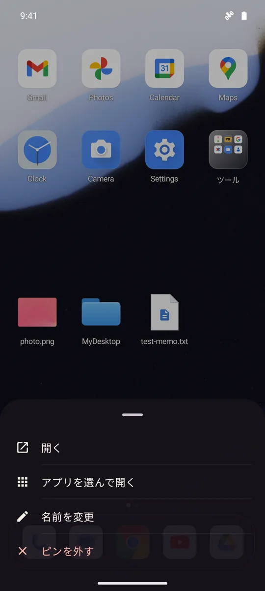
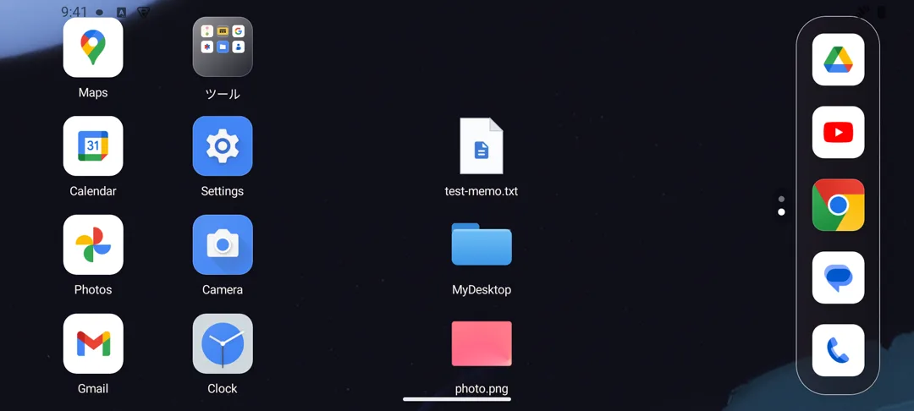
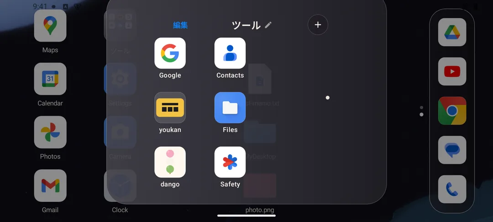
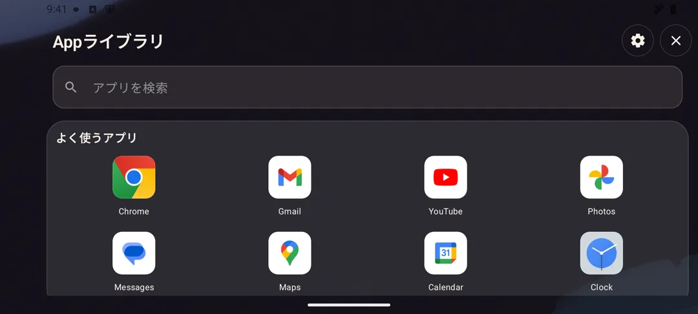

# ohagi

ohagi は、壁紙を主役にしたミニマルな Android ホームランチャーです。iOSを意識した「左端のウィジェット／複数ホーム／右端のAppライブラリ」というページ構成、4列×6行のホーム、ホーム上で常時表示するDock、自動カテゴリー、公式Compose Drag and Drop、OS標準の分割画面起動に加え、macOSデスクトップのように任意のファイル／フォルダをホームへピン留めする機能と、アイコン配置を保ったまま向きだけ追従する横画面対応をひとつにまとめています。

- Application ID: `io.github.hatake716.ohagi`
- Version: `0.2.0` (`versionCode = 2`)
- Android: `minSdk 26` / `targetSdk 36` / `compileSdk 36`
- UI: Kotlin + Jetpack Compose
- License: [Apache License 2.0](LICENSE)

## スクリーンショット

| ホーム / 常時表示Dock | ウィジェット専用ページ | 追加されたホームページ | 右端のAppライブラリ |
|:--:|:--:|:--:|:--:|
|  |  |  |  |
| 4×6ホームと5スロットDock。画像サムネイル付きの `photo.png`、青いフォルダの `MyDesktop`、書類アイコンの `test-memo.txt` をピン留め | Android標準ウィジェットをまとめる左端ページ。Dockは非表示 | 最終ホームの右端へD&Dするとページを追加し、落とした位置のセルへ配置 | 検索欄の下に「よく使うアプリ」カード、その下に2列カテゴリーカード |

| ホーム／Dock共通フォルダ | カテゴリー内アプリ | 分割起動ピッカー | 空きセルの長押しメニュー |
|:--:|:--:|:--:|:--:|
|  |  |  |  |
| 3×3グリッド、ページドット、名称変更、追加、編集モード | カテゴリーを開くと4列グリッドで一覧表示 | 通知の `ohagi` から開き、通常起動済みのアプリへ追加する2つ目を選択 | 空きセルの長押しから「アプリを置く」「ファイルを置く」「フォルダを置く」 |

| ピンの長押しメニュー |
|:--:|
|  |
| ファイルピンは長押しから「開く」「アプリを選んで開く」「名前を変更」「ピンを外す」。フォルダピンでは「アプリを選んで開く」を除く3項目 |

横画面では、ホーム・Dock・フォルダのレイアウト位置を縦持ちのまま保ち、アイコンと名称だけが端末の向きへ立ち直ります。Appライブラリと分割起動ピッカーは画面の向きどおりの横レイアウトになります。

| 横画面のホーム / Dock |
|:--:|
|  |

| 横画面で開いたフォルダ | 横画面のAppライブラリ |
|:--:|:--:|
|  |  |

表示されるアプリ、分類結果、壁紙は端末によって異なります。

## 現在の主な機能

- 1ページあたり4列×6行・24セル、最大10ページのホームグリッド
- 最終ホームの右端へ項目をD&Dすると、新しいホームページを自動生成し、落とした位置のセルへ配置
- ページをまたぐD&Dでも、ドロップした位置のセルへそのまま配置（iOSと同じ使い勝手）
- 項目が0件になった追加ホームを即時削除し、後続ページをセル位置ごと左へ繰り上げ
- 左端にAndroid標準ウィジェット専用ページ、右端にAppライブラリを置くiOS風ページ構成
- macOSデスクトップのように、SAFで選んだ任意のファイル／フォルダをホームの空きセルへピン留め
- 画像／動画／PDFピンのサムネイル表示、それ以外は種類色シンボル付きのmacOS風書類アイコン、フォルダはBig Sur風の青いフォルダ
- ピンのタップで関連アプリ起動（フォルダピンはFinder風ファイラー [dango](https://github.com/hatake716/dango) を優先し、無ければOS標準へフォールバック）
- 画面上のメニューボタンを置かず、長押し（動かさず離す）でコンテキストメニュー、そのままドラッグでD&DになるiOS風の操作統合
- ホーム空きセルの長押しメニューから「アプリを置く」「ファイルを置く」「フォルダを置く」
- 5つすべてにアプリ／フォルダを配置でき、ホーム上だけで常時表示するDock
- インストール済みアプリを自動分類するAppライブラリと、起動履歴による「よく使うアプリ」カード
- 通常ドロワー、分割起動、Dock割り当て、フォルダ追加、空きセルへの配置で共通のカテゴリー選択UI
- カテゴリーカードからの直接起動、カテゴリー内4列表示、全アプリ横断検索
- iOSを意識した60dpのホームアイコン、4列の余白比、角丸、控えめな縁と影、半透明パネル
- アイコン位置から拡大するアプリ起動、元のページを保つ復帰、アイコン位置へ戻るフォルダ開閉
- 指へ連続追従するページ／Dock／ページドット、カテゴリー画面の短いズーム遷移
- 押下時の沈み込み、D&Dのlift・半透明プレースホルダー・target拡大・スプリング着地
- 実体キーを追跡するホーム／Dock／フォルダ内アイコンのスプリング並べ替え
- Compose公式Drag and Dropによる配置、入れ替え、領域間移動、配置削除
- ホーム／Dock共通のiOS風フォルダ（3×3ページ、プレビュー、名称変更、追加、並べ替え、外への移動）
- 横画面でもアイコン位置・Dock位置は縦持ちのまま、アイコンと名称だけ端末の向きへスプリングで立ち直る回転対応（Appライブラリと分割起動ピッカーは真の横レイアウト）
- `AppWidgetHost`による実ウィジェット表示、検索式ピッカー、OS許可・設定、幅／高さ変更、並べ替え、削除
- ホーム／Dock／フォルダ／Appライブラリから1つ目を通常起動し、通知の `ohagi` から2つ目を選ぶOS標準分割画面
- DataStoreによる複数ホーム／Dock／フォルダ／ピン／ウィジェット配置の端末内保存
- Androidのホームアプリ役割を要求する設定導線

## ホームとDock

各ホームページは縦6行・横4列の固定グリッドです。各セルは空き状態を保持するため、アプリやフォルダを任意の位置へ配置できます。最終ホーム上の項目を画面右端までドラッグして離すと、Appライブラリの手前に新しいページを1枚追加し、その項目を落とした位置のセルへ原子的に移動します。既存ページへまたいで運んだ場合も、指を離した位置のセルへそのまま配置し、別項目の中央へ重ねればフォルダ化／追加として扱います（セルを特定できない場合のみ先頭の空きセルへ退避します）。追加ページから最後の項目を移動・削除すると、そのページは同じDataStore更新内で自動削除されます。途中のページが空になった場合も後続ページを左へ詰め、先頭ホームだけは空でも必ず残します。上限は10ページです。

ページは左から次の順に並びます。

1. ウィジェット専用ページ
2. 1枚以上のホームページ
3. Appライブラリ

このため、指の動きとしては最初のホームを**右へスワイプ**すると左隣のウィジェットページへ、最終ホームを**左へスワイプ**すると右隣のAppライブラリへ移動します。ホームを複数作成した場合は、その間を通常の横スワイプで移動できます。画面下部のページドットはホームページだけを示します。

レイアウトの永続化形式はv9です。v9ではホームへのファイル／フォルダピン（後述）が加わりました。v9のデータを旧バージョンのohagiで読むことはできず、ダウングレードするとレイアウトが初期化されます。v7以前のウィジェット配置は幅を持たないため、従来どおり画面に追従する全幅として読み込みます。既存v6以前の4スロットDockは、左側2枠を新しい0・1番、右側2枠を3・4番へ保ったまま移し、新しい中央の2番を空きスロットとして追加します。既存のv5データは24セルをそのまま第1ホームとして読み込み、ウィジェット未配置の状態で利用できます。旧v4の5列×6行データを読み込んだ場合は次のように移行します。

1. 各行の左4セルは同じ行・列を維持します。
2. 旧5列目にあった項目は、4×6内の空きセルへ順番に退避します。
3. 第1ページの24セルを超える旧項目は保持できないため、移行前のv4データでは空きセルの確保を推奨します。

Dockはホームページ上で常時表示され、ウィジェット専用ページとAppライブラリではコンテンツ領域を確保するため非表示になります。以前の「アプリ起動後に隠し、下端スワイプで再表示する」動作と中央の固定ランチャーボタンは廃止されています。5つの全スロットへアプリまたはフォルダを置けます。ホームとDockのフォルダは同じ見た目と編集機能を使い、フォルダ自体も両領域の間で移動できます。

## ホームへのファイル／フォルダピン

macOSのデスクトップにファイルを置く感覚で、任意のファイルやフォルダをホームの空きセルへピン留めできます。

- ホームの空きセルを長押しすると「アプリを置く」「ファイルを置く」「フォルダを置く」のメニューが開きます。ファイルはAndroid標準のドキュメント選択（Storage Access Framework の `ACTION_OPEN_DOCUMENT`）、フォルダはツリー選択（`ACTION_OPEN_DOCUMENT_TREE`）で選びます。
- アクセスには読み取り専用の永続URI許可だけを使用します。全ファイルアクセス権限（`MANAGE_EXTERNAL_STORAGE`）や追加のManifest権限は使いません。
- 画像・動画・PDFのピンは縦横比を保ったサムネイルで表示し、動画には再生バッジを重ねます。サムネイルを持たない種類は、macOSの書類アイコン風の「角の折れた白い書類」に種類別の色シンボル（画像／動画／音声／PDF／文書／アーカイブ／その他）を載せて描画します。フォルダピンはmacOS Big Sur風の青いフォルダをCanvasで描きます。
- ファイルピンをタップすると、MIMEタイプに応じた関連アプリで開きます（`ACTION_VIEW`）。開けるアプリがない場合や、実体が削除・SDカード取り外しなどで読めない場合はトーストで案内し、ピン自体は自動削除しません。
- フォルダピンをタップすると、Finder風ファイラーの [dango](https://github.com/hatake716/dango) がインストールされていればdangoで、無ければOS標準のファイルアプリで開きます。
- ピンの長押しメニューは、ファイルが「開く」「アプリを選んで開く」「名前を変更」「ピンを外す」、フォルダが「開く」「名前を変更」「ピンを外す」です。名前の変更はohagi上の表示名だけを変え、実体はリネームしません。「ピンを外す」も配置を取り除くだけで、実体のファイルやフォルダは削除しません。
- ピンはホーム専用です。D&Dによる並べ替え・ページをまたぐ移動・削除領域への配置解除はアプリと同様にできますが、Dockへの移動や、アプリを重ねてのフォルダ化はできません。
- 長押しメニューからピンを外すと、それが同じ場所を指す最後のピンだった場合に永続URI許可を解放します（削除領域へのドラッグによる配置解除では解放しません）。OSの永続許可には上限（Android 11以降512件、それ以前128件）があるため、120件に達すると上限接近をトーストで警告します。

詳細な仕様は [docs/SPEC_HOME_FILES.md](docs/SPEC_HOME_FILES.md) を参照してください。

## Appライブラリと自動カテゴリー

インストール済みの起動可能アプリは、Androidが公開する `ApplicationInfo.category` を主な入力として自動分類されます。Androidの標準カテゴリーだけでは不足する分野は、パッケージ名と表示名の補助判定で補完します。

現在のカテゴリーは次の11種類です。

- ソーシャル
- 仕事とファイナンス
- 写真とビデオ
- エンターテインメント
- ゲーム
- 情報と読書
- 旅行と天気
- 買い物とフード
- 健康とフィットネス
- ユーティリティ
- その他

Appライブラリの概要先頭には、ohagiからの起動回数と最終起動時刻に基づく「よく使うアプリ」を最大8件、4列×2段で表示する専用カードがあります。その下は2列の自動カテゴリーカードです。頻出アプリを専用カードへ表示しても通常カテゴリーからは取り除かれず、カテゴリー詳細と検索には常に全アプリが残ります。各カテゴリーカードの7枠でも起動履歴を優先し、履歴のない枠はDock、ホーム、両領域のフォルダへ置いた順で補います。履歴は端末内だけに保存し、Androidの利用状況へのアクセス権限やクラウドサービスは使いません。専用カードとカテゴリーカード内の大きいアイコンはアプリを直接起動または選択し、カテゴリーカード本体か小さいアイコン群を押すとカテゴリー内の4列一覧へ移動します。

このカテゴリーUIは次のすべての選択画面で共用しています。

- 最終ホームの右隣にある通常のAppライブラリ
- 通常起動後、通知の `ohagi` から開く分割起動用の2つ目の選択
- Dockスロットへのアプリ割り当て
- ホーム／Dockフォルダへのアプリ追加・新規フォルダ作成（複数選択対応）
- ホーム空きセルの長押しメニュー「アプリを置く」からの配置

分類は端末が持つメタデータと補助ルールに基づくため、ストア上のカテゴリーと完全に一致するとは限りません。「よく使うアプリ」の判定にはohagi自身から成功した起動だけを端末内で記録し、他アプリの利用状況は読み取りません。

## ウィジェット専用ページ

最初のホームの左隣には、Android標準App Widgetだけをまとめる専用ページがあります。このページではDockを表示しません。

- 右上または空状態カードの「＋」から、端末にインストールされたホーム画面向けウィジェットを選択できます。
- ピッカーはウィジェット名・提供アプリ名を対象に検索できます。
- 追加時はAndroid標準の確認画面を開きます。提供元が設定画面を持つ場合は、その設定も完了してから配置します。
- `AppWidgetHostView`で提供元の実際のRemoteViewsを表示し、ホストの開始／停止と画面サイズ通知をActivityライフサイクルに同期します。
- 「編集」では上下への並べ替え、削除、右下の青いハンドルによる幅／高さ変更ができます。ドラッグ中はサイズを表示し、指を離すと8dp単位で保存します。提供元が横方向または縦方向の変更を許可していない場合、その方向は変更しません。
- サイズ変更の確定時は、新しいdp寸法とAndroid 12以降の候補サイズ一覧を`AppWidgetHostView`経由で提供元へ通知します。削除時はDataStoreの配置だけでなく、割り当て済みApp Widget IDも解放します。
- 許可や設定をキャンセルした場合も、仮確保したIDを解放して未完成の配置を残しません。

ohagiが保存するのはApp Widget ID、提供元コンポーネント、表示幅／表示高、並び順だけです。ウィジェット内の表示内容や通信は提供元アプリが管理します。

## 操作方法

画面上に「⋯」のようなメニューボタンは置いていません。配置済みの項目は**長押しして、動かさずに離すとメニュー**、**そのまま動かすとドラッグ**になります。

| 場所 | 操作 | 動作 |
|---|---|---|
| ホーム | アプリアイコンをタップ | アプリを通常起動 |
| ホーム | フォルダをタップ | 3×3ページ式のフォルダを開く |
| ホーム | ファイル／フォルダのピンをタップ | 関連アプリまたはdango／ファイルアプリで開く |
| ホーム | 項目を長押ししてドラッグ | ホーム内で入れ替え、またはDockへ移動。アプリを別アプリ／フォルダ中央へ重ねるとフォルダ化／追加 |
| ホーム | アプリを長押しして離す | 起動、アプリを選んでフォルダ作成、アプリ情報、配置削除、アンインストールのメニュー |
| ホーム | フォルダを長押しして離す | 開く、アプリを追加、名前を変更、配置削除のメニュー |
| ホーム | ピンを長押しして離す | 開く、（ファイルのみ）アプリを選んで開く、名前を変更、ピンを外すのメニュー |
| ホーム | 空きセルを長押し | 「アプリを置く」「ファイルを置く」「フォルダを置く」のメニュー |
| 最終ホーム | 項目を右端までドラッグしてドロップ | Appライブラリの手前にホームを1枚追加し、落とした位置のセルへ配置 |
| ホーム背景 | 左右にスワイプ | 複数ホーム間を移動。最初のホームから右へスワイプするとウィジェット、最終ホームから左へスワイプするとAppライブラリ |
| Dock | アプリをタップ | アプリを通常起動 |
| Dock | フォルダをタップ | フォルダを開く |
| Dock | 項目を長押ししてドラッグ | Dock内で入れ替え、またはホームへ移動。アプリを重ねるとフォルダ化／追加 |
| Dock | 項目を長押しして離す | 起動／開く、フォルダ操作、アプリ情報、配置削除のメニュー |
| Dock | 空きスロット（＋）をタップ | 「アプリを割り当て」メニューを開く |
| 開いたフォルダ | 左上の「編集」 | アイコンを揺らし、各アプリの「−」でフォルダから除外 |
| 開いたフォルダ | 名前／鉛筆、右上の「＋」 | 名前変更、カテゴリー式ピッカーから複数アプリ追加 |
| 開いたフォルダ | アプリを長押ししてドラッグ | フォルダ内で並べ替え。パネル外へ運ぶとホーム／Dockへ移動 |
| Appライブラリ | カード内の大きいアイコンをタップ | アプリを直接起動または選択 |
| Appライブラリ | カード本体／小アイコン群をタップ | カテゴリー内の4列一覧を開く |
| Appライブラリ | アプリを長押ししてドラッグ | ホームまたはDockへ配置 |
| Appライブラリ | アプリを長押しして離す | Dock追加、アプリ情報、アンインストールのメニュー |
| 1つ目のアプリ起動後 | 通知内の `ohagi` をタップ | 自動カテゴリー式の選択画面を開き、分割する2つ目のアプリを選択 |
| ウィジェットページ | 「＋」 | 検索式ピッカーとAndroidの確認／設定画面を経てウィジェットを追加 |
| ウィジェットページ | 「編集」 | ウィジェットの表示順変更、右下ハンドルでのサイズ変更、または削除 |

ホームまたはDockの配置済み項目をドラッグすると、画面上部に削除領域が表示されます。そこへドロップするとohagi上の配置だけを削除し、アプリ本体はアンインストールしません。アンインストールは長押しメニューからAndroidの確認画面を開いて実行します。

## Drag and Drop

D&DはCompose公式の `Modifier.dragAndDropSource` と `Modifier.dragAndDropTarget` を使用しています。ドラッグデータはohagi専用MIME型の `ClipData` とシリアライズ済みpayloadで受け渡し、他アプリのドラッグを誤って受け入れないようにしています。

モーションはiOSホームを意識して全配置面で共通化しています。タッチ中は94%へ短く沈み、長押し成立後は元位置を90%・不透明度14%のプレースホルダーとして残します。指下には約1.1倍の半透明アイコン、角丸マスク、二層影、白い縁を持つdrag decorationを表示します。通常のドロップ先は104%、フォルダ化できる中央領域はフォルダ内部の拡大を含めて約112%まで持ち上がり、成立時は低減衰springで等倍へ収束します。キャンセル時も同じspringで自然に元へ戻ります。

| ドラッグ元 → ドロップ先 | 結果 |
|---|---|
| アプリ → 空きセル／スロット | その位置へ移動または配置 |
| アプリ → 別アプリの中央 | 2アプリをまとめてフォルダを作成。共通カテゴリーがあれば初期名へ使用 |
| アプリ → 既存フォルダ | フォルダへ追加 |
| 項目 → セル／スロット外周 | アプリまたはフォルダを入れ替え（空き位置との入れ替えを含む） |
| ホームの項目 → Dock／Dockの項目 → ホーム | アプリ／フォルダを型変換して移動。相手がいれば項目ごと入れ替え |
| 開いたフォルダ内 → 同じフォルダ内 | 3×3ページでの表示順を変更 |
| 開いたフォルダ内 → ホーム／Dock | アプリだけをフォルダ外へ移動。最後のアプリを外して空になるとフォルダを自動削除 |
| Appライブラリ → ホーム／Dock | 指定位置へアプリを配置。中央へ重ねればフォルダ化／追加 |
| 項目 → 別のホームページのセル | ページをまたいでも、落とした位置のセルへそのまま配置・入れ替え・フォルダ化 |
| 最終ホームの項目 → 画面右端 | 新しいホームページを生成し、取得元の除去と落とした位置への配置を1回のDataStore更新で完了 |
| ファイル／フォルダのピン → ホームのセル | ホーム内・ページ間で移動または入れ替え（Dockへは移動できず、アプリを重ねてもフォルダ化しない） |
| ホーム／Dock／フォルダ内 → 削除領域 | ohagi上の配置だけを削除（ピンは配置解除のみで実体は残る） |

アプリを重ねる判定は、60dpのアイコンを囲む中央68dp領域です。フォルダの中身を取り出す操作と取得元の更新は1回のDataStoreトランザクションで処理するため、移動途中の複製や消失を防ぎます。iOSと同様にアプリが1個だけになってもフォルダは維持し、空になった時だけ自動削除します。ホームページの空判定も同じ正規化処理で行い、項目（アプリ・フォルダ・ピン）が1件もない追加ページだけを削除します。

## モーション設計

画面ごとに別々の速度を置かず、`IosMotion`に短い非対称easing、速度を自然に引き継ぐspring、ページのスナップ閾値、並べ替えの配置specを集約しています。主な動作は次のとおりです。

- ホーム、ウィジェット、Appライブラリの横移動は、指の連続位置へページの縮尺と透明度が追従し、離した後は共通springで最寄りページへ収束します。Dockとホーム用ページドットも同じ位置から表示率を計算するため、ページ確定後に遅れて消えることはありません。
- ホーム／Dock／フォルダ／Appライブラリでタップした実アイコンの画面座標を取得し、Androidの`ActivityOptions.makeScaleUpAnimation`へ渡します。起動先から戻る時は遷移前のホームページを保ち、OS遷移の末尾へ短い縮尺・透明度の着地をつなぎます。
- フォルダは中央から一律に出すのではなく、タップしたホームまたはDockアイコンの中心・幅からパネル全体へ拡大します。背景の暗転も同じ進捗へ同期し、背景タップとBack操作では逆方向にアイコン位置へ収束してから閉じます。
- Appライブラリと分割起動ピッカーは、概要、カテゴリー詳細、検索を画面モードとして扱います。概要からカテゴリーへは短い拡大、戻る時は逆方向、検索との切り替えは控えめなクロスフェードを使い、検索文字を入力するたびに画面遷移を再実行しません。
- ホーム、Dock、開いたフォルダの各項目はスロット番号ではなくアプリ／フォルダ自身の安定キーで追跡します。入れ替え後に瞬間移動させず、2つの項目がそれぞれ新しい位置へspringで移動します。名前変更やフォルダ内順序変更だけではフォルダ本体の同一性を失いません。移動後もD&D nodeは`rememberUpdatedState`から現在のpayloadを読むため、同じアイコンを再起動せず即座に逆方向へ動かせます。
- D&D中は操作対象と現在のdrop targetだけをアニメーションさせます。ページの隣接常駐、画面Bitmapの複製、待機中に回り続けるtransitionは追加していないため、Low-RAM端末向けのキャッシュ上限を維持します。

Androidの通常権限ランチャーが直接制御できるのは、タップ元からの起動オプションとohagi自身が再表示された後の描画です。任意の他アプリが閉じる途中のシステム画面そのものはAndroidが所有するため、特権ランチャー専用のRemote TransitionやiOSの非公開APIには依存していません。また、端末のアニメーション倍率を無効にした場合はCompose／Android標準の設定に従います。

## 横画面対応と省メモリ設計

Activityの縦画面固定は行わず、Androidの自動回転に従います。ただしiOSのホーム画面と同様に、横画面でもホーム・Dock・フォルダのレイアウトそのものは回しません。

- 回転を含む構成変更は `android:configChanges` で自前処理し、Activityを再生成しません。
- 横画面では、UI全体を縦向きの寸法・配置のまま逆方向へ90度回して描くステージ（`PortraitStage`）に載せることで、アイコンやDockの物理的な位置を縦持ちと同一に保ちます。
- その上で、各アイコンと名称のブロックだけが端末の向きへスプリングで立ち直ります（ホームセル、Dockスロット、開いたフォルダ内、ピンのすべてが対象）。
- 開いたフォルダでは、タイトル・編集・「＋」のヘッダがユーザーから見て上になる辺へ移動し、アイコンの重なりを避けるためグリッドを少し下げ、最下段の名称が切れないよう背景を広げます。いずれも描画変換だけで行い、レイアウトとヒット判定の整合はComposeの `graphicsLayer` に任せます。
- Appライブラリと分割起動ピッカーは例外で、画面の向きどおりの「真の横レイアウト」になります。Appライブラリは `PortraitStage` の逆回転を打ち消して実現しています。
- マウス等のポインタ入力はOSが横向きの画面として扱うため、回転後も自然に操作できます。

アプリを起動した後の画面方向は、起動先アプリとAndroidの設定に従います。

RAMの少ない端末でも長時間使えるよう、再生成可能なデータを中心に保持量を制限しています。

変更内容、比較条件、測定結果と確認範囲は[動作・メモリ最適化の検証記録](docs/PERFORMANCE.md)にまとめています。

- アプリアイコンは表示寸法に応じて32／48／72／96／144／192pxへ段階化し、表示専用のHardware Bitmapへ変換してから公開します。表示に必要なピクセル数以上を選び、従来の192px上限は維持します。たとえば密度3倍のフォルダ内プレビューは96pxから48pxとなり、同じ表示寸法で画像のピクセル容量を4分の1に抑えます。
- アイコンキャッシュはバイト数で上限を管理し、通常端末は6MiB、AndroidがLow-RAM端末と判定した場合は3MiBに制限します。
- `onTrimMemory`／`onLowMemory`を受けると、前面低メモリ時は2MiB、UI非表示時は通常3MiB／Low-RAM端末1MiBまで縮小し、重大なメモリ圧迫時は1MiB、バックグラウンド圧迫時は全解放します。
- 空のホーム／Dockセルはアイコン監視Coroutineを作らず、表示アイコンとD&D装飾は同じBitmapを共有します。
- 初期ホームが操作されていない短い時間だけAppライブラリ上端のアイコンを制限付きworkerで先読みします。「よく使うアプリ」は最大8件に限定し、通常端末は続く完全表示4カテゴリ＋下端2カテゴリの上段、Low-RAM端末は2カテゴリだけを対象にして、全アプリの一括保持やUIスレッドへの大量生成を避けます。専用カードとカテゴリーカードでは全アイコンの完了を待たず、取得できたものから順に表示します。
- ファイルサムネイルは画像の実容量で管理し、通常4MiB／Low-RAM端末2MiBを上限にします。URIと要求サイズが同じ読み込みは共有し、providerへの同時アクセスを通常2件／Low-RAM端末1件に制限します。全利用者が離れた要求はキャンセルし、失敗はキャッシュせず再訪時に再試行します。過大なprovider画像は縦横比を保って表示サイズ内へ縮小します。
- アイコンとサムネイルはメモリ通知でキャッシュを縮小します。通知前から動いていた読み込みが、解放直後のキャッシュを再充填しないよう世代を管理します。画面で使用中の画像を直接recycleしません。
- ウィジェットページは通常の往復で`AppWidgetHostView`を再利用し、内部のスクロール位置などを維持します。ドラッグ中はCompose上の枠だけを更新し、提供元へのBinderサイズ通知とDataStore書き込みは確定時に限定します。実メモリ圧迫時には、表示中のViewがなくなってからAndroidのhost内部の強参照も解放します。ウィジェットID・設定・保存サイズは維持し、再表示時に最新のRemoteViewsを取得します。
- アプリ一覧の全件走査は連続要求をまとめ、前面復帰時の再走査を15秒間隔に抑えます。
- DataStoreへのレイアウト変更は単一キューで操作順を維持し、操作ごとのCoroutine生成を避けます。
- フォルダの無限揺れアニメーションは編集モード中だけ実行し、通常表示ではcompositionから外します。
- D&Dモーションは操作中のセルだけが状態遷移し、待機中に回り続けるアニメーションを追加していません。
- ページとカテゴリー遷移は描画レイヤーの縮尺・透明度を中心に行い、画面全体のBitmap snapshotや隣接ページの常時先読みを追加していません。
- ページの小数位置、押下／D&Dの縮尺・透明度、アイコン回転は描画レイヤーで状態を読みます。アニメーションだけでHomeScreen全体や各セルを毎フレーム再構成する処理を避け、ページ番号の読み上げは整数ページが変わった時だけ更新します。

## 分割画面起動

ohagi自身がウィンドウを分割・管理するのではなく、Androidの標準タスク／分割画面機能を使用します。操作は次の順です。

1. ホーム、Dock、フォルダ、またはAppライブラリから、1つ目のアプリを普段どおりタップして起動します。
2. ohagiが、その起動したアプリを1つ目として紐づけた通知を表示します。
3. 通知内の `ohagi` をタップし、自動カテゴリー式のAppライブラリを開きます。
4. 2つ目のアプリをカテゴリーまたは検索から選ぶと、Android標準の分割画面へ移行します。

通知を開くと、履歴に残らない非公開の選択Activityが表示されます。2つ目の選択後は、そのActivityを有効な起点として2つ目を `FLAG_ACTIVITY_LAUNCH_ADJACENT` と `FLAG_ACTIVITY_NEW_TASK` 付きで隣接起動し、OSから分割成立が通知された後に主画面側を1つ目へ差し替えます。

- 1つ目は先に通常起動され、ohagiが起動した正確なコンポーネントを通知へ保持します。Android全体の利用状況や現在前面のアプリを推測する権限は使用しません。
- 通常起動のIntentを最初にAndroidへ渡し、通知の組み立てと更新は画面遷移開始後の直列workerで行います。
- 1つ目のアプリが表示された後にユーザー自身が通知を開くため、cold startの時間を固定遅延で推測しません。
- 2つ目の隣接起動と1つ目の配置はOSの分割状態コールバックで区切り、同じ画面遷移へ混在させません。
- 通知の `PendingIntent` は非公開の分割起動Activityを直接指し、BroadcastReceiver／Serviceの通知トランポリンを使用しません。
- `PendingIntent` は変更不能ですが繰り返し利用できます。`ohagi` をタップしても通知は消えず、分割完了後も同じ1つ目に対して再利用できます。次にohagiから別のアプリを通常起動すると、通知の紐づけと表示を最新の1つ目へ置き換えます。
- 通知は常駐通知として表示し、タップや分割完了では自動削除しません。Android 14以降ではOSの仕様によりユーザー自身の横スワイプで明示的に消すこともでき、通知設定から「画面分割」チャンネルまたはohagiの通知権限を無効にすることもできます。
- Android 13以降では、最初の通常起動操作の文脈で通知権限を一度だけ要求します。拒否された場合や通知チャンネルが無効な場合もアプリは通常起動しますが、通知を使う分割導線は表示されません。
- この機能はohagi自身の常駐通知を表示するだけで、他アプリの通知内容を読み取りません。

- 縦画面では通常は上下、横画面では通常は左右に配置されます。
- Android 12L（API 32）以降を主対象とします。
- API 31以前でも起動は試みますが、分割画面への移行は保証されません。
- 端末、対象アプリの `launchMode`、既存タスクの状態によっては、2つ目が全画面で起動する場合があります。
- 他アプリの前面タスク状態を通常権限で完全には監視できないため、OS側の分割状態はDataStoreへ保存しません。

## データとプライバシー

ホーム、Dock、フォルダ、ピン、ウィジェットの配置情報は、AndroidX DataStoreを使ってアプリ専用領域の `layout.json` に保存します。ウィジェットについて保存するのはID、提供元コンポーネント、表示幅／表示高、並び順であり、ウィジェットが表示する内容そのものは保存しません。「よく使うアプリ」用には、ohagiから起動に成功したアプリのコンポーネント、回数、最終時刻だけを `usage.json` に保存します。

ピン留めしたファイル／フォルダについて保存するのは、SAFのURI文字列・表示名・MIMEタイプ（MIMEタイプはファイルピンのみ）だけです。ファイルの内容やパスの実体は保存せず、サムネイルもメモリ内キャッシュのみでディスクへ書き出しません。アクセスはSAFの読み取り専用の永続URI許可だけで行い、書き込み許可や全ファイルアクセス権限（`MANAGE_EXTERNAL_STORAGE`）は取得しません。ピンを外しても実体は削除されず、長押しメニューから同じ場所を指す最後のピンを外した時に永続許可を解放します。

- インターネット権限は要求しません。
- `POST_NOTIFICATIONS` は、通常起動した1つ目に追加する2つ目をユーザー操作で選ぶ通知だけに使用します。通知アクセス権限は要求せず、他アプリの通知を読み取りません。
- 個人情報、アプリ利用履歴、レイアウトを外部へ送信しません。
- Androidバックアップと端末間転送は、Manifestと`dataExtractionRules`の両方で明示的に無効化しています。
- アプリ一覧は端末上のランチャー対象Activityから取得します。
- ウィジェットの追加はAndroid標準の `ACTION_APPWIDGET_BIND` でユーザー確認を受けます。提供元ウィジェット自身の通信・データ処理には、その提供元アプリのプライバシーポリシーが適用されます。

詳細は [プライバシーポリシー](docs/PRIVACY_POLICY.md) を参照してください。

## プロジェクト構成

単一Androidアプリモジュールで、Jetpack Compose、DataStore、kotlinx.serialization、手動DI（`Graph`）を使用しています。

| パス | 役割 |
|---|---|
| `data/Model.kt` | `AppRef`、ホーム／Dock項目（ファイル／フォルダピンを含む）、複数ページ、ウィジェット配置モデル |
| `data/LayoutRepository.kt` | DataStore永続化、レイアウト移行、配置・移動・入れ替え、空の追加ページの共通正規化 |
| `data/LayoutFolderOperations.kt` | フォルダ内外・ホーム／Dock間を原子的に更新する純粋関数 |
| `data/LayoutPageOperations.kt` | 右端ページ生成、全空追加ページの圧縮、ページ切替D&D、ウィジェット順序／サイズ変更の純粋関数 |
| `data/AppRepository.kt` | 起動可能アプリの列挙、ラベル・カテゴリー、段階解像度アイコン、容量制限キャッシュ、低メモリ解放 |
| `data/UsageRepository.kt` | 端末内の起動回数／最終時刻、既存version 1履歴の互換読込、よく使うアプリの優先順 |
| `data/AppCategory.kt` | Androidカテゴリーと補助ルールによる自動分類 |
| `ui/HomeScreen.kt` | Widget／Home／AppライブラリPager、Dock表示、D&D規則、起動導線の統合 |
| `ui/home/HomeGrid.kt` | 4×6ホームセルの表示とD&D source／target |
| `ui/dock/DockBar.kt` | 常時表示Dock、フォルダプレビュー、D&D source／target |
| `ui/folder/IosFolderOverlay.kt` | ホーム／Dock共通の3×3ページ式フォルダ表示・編集・D&D |
| `ui/drawer/AppDrawer.kt` | Appライブラリ、アプリのドラッグ元、操作メニュー |
| `ui/widget/WidgetPage.kt` | Dockを持たないウィジェット専用ページ、実ウィジェット表示、編集、サイズ変更ハンドル |
| `ui/widget/WidgetPickerSheet.kt` | インストール済みウィジェットの検索・選択UI |
| `SplitLaunchActivity.kt` | 通知からカテゴリー式ピッカーを表示し、OSの分割成立後に主画面側を1つ目へ差し替え |
| `ui/common/SplitAppPickerScreen.kt` | 通知専用の2つ目選択画面。Appライブラリと同じカテゴリー／4列／検索UIを再利用 |
| `util/SplitLaunchNotification.kt` | 通常起動した1つ目を保持し、非公開ピッカーを繰り返し開ける常駐通知PendingIntentと通知チャンネル |
| `widget/WidgetHostController.kt` | App Widget ID、許可・設定、HostView、サイズ通知、ライフサイクル管理 |
| `ui/common/CategorizedAppBrowser.kt` | 全選択画面で共用するカテゴリーカードと4列一覧 |
| `ui/common/IosMotion.kt` | ページ、フォルダ、押下、配置変更で共有するspring／easingと安定モーションキー |
| `ui/common/IosStyle.kt` | 共通アイコン形状、押下／D&D／着地モーション、半透明コントロール |
| `ui/common/DeviceOrientation.kt` | 横画面でも縦配置を保つ `PortraitStage` と、アイコンだけを直立させる補正角のspring追従 |
| `ui/common/FilePinIcon.kt` | ピンのサムネイル表示と、macOS風の書類アイコン／Big Sur風フォルダアイコンのCanvas描画 |
| `util/FilePinUtils.kt` | SAFピンの作成、永続URI許可の取得／解放と上限警告、関連アプリ／dangoで開く動作、サムネイル取得とキャッシュ |
| `ui/dragdrop/DragPayload.kt` | ohagi専用D&D payload、MIME型、長押しメニューとドラッグを1つの長押しへ統合する共通modifier、角丸lift decoration |
| `util/AppLaunchRequest.kt` | アプリ参照とタップ元アイコン矩形を安全に運ぶ起動要求 |
| `util/LaunchUtils.kt` | アイコン起点の起動animation、通常／隣接／同一タスクIntent、アプリ情報、アンインストール、ホーム役割要求 |

## ビルド

### 必要環境

- JDK 17
- Android SDK Platform 36
- Android Build Tools 36系

### デバッグビルドと検証

```sh
./gradlew :app:assembleDebug :app:testDebugUnitTest :app:lintDebug
```

デバッグAPKは `app/build/outputs/apk/debug/app-debug.apk` に生成されます。接続済み端末へ上書きインストールする場合は次を実行します。

```sh
adb install -r app/build/outputs/apk/debug/app-debug.apk
```

リリース用Android App Bundleは次で生成できます。署名する場合はプロジェクトルートへ `keystore.properties` を用意してください。

```sh
./gradlew :app:bundleRelease
```

Google Play公開前の確認事項は [PLAY_CHECKLIST.md](docs/PLAY_CHECKLIST.md) を参照してください。

## ライセンス

ohagiのオリジナルのソースコードとドキュメントは、特に明記のない限り [Apache License 2.0](LICENSE) の下で利用できます。著作権表示と、再配布時に保持する帰属情報は [NOTICE](NOTICE) を参照してください。

依存ライブラリにはそれぞれのライセンスが適用されます。ドキュメントやスクリーンショットに表示される第三者のアプリ名、アイコン、製品名、商標は各権利者に帰属し、Apache License 2.0によってそれらの利用権が付与されるものではありません。

## 既知の制約

- ホームは1ページ24セル・最大10ページです。ページの任意追加／削除UIはなく、最終ページ右端へのD&Dで追加します。先頭以外は項目が0件になった時点で自動削除され、中間ページなら後続ページが左へ詰まります。
- ウィジェットは提供元の`resizeMode`、最小リサイズ幅／高さ、Android 12以降の最大リサイズ幅／高さの範囲で変更できます。提供元がリサイズ非対応の場合は固定サイズです。
- ウィジェットの表示内容や設定画面の外観、更新頻度、ネットワーク要否は各提供元アプリに依存します。
- iOSのシステムアイコン、独自フォント、壁紙ぼかしAPIそのものは使用せず、Composeの角丸・半透明・影・スプリングで近い外観を構成しています。
- 任意の起動先アプリを閉じる途中のシステム遷移はAndroidが所有します。ohagiはタップ元からの起動と、ホームが再表示された後の着地を連続させますが、特権ランチャー専用Remote Transitionは使用しません。
- レイアウトv9のデータは旧バージョンのohagiでは読めず、ダウングレードするとレイアウトが初期化されます。
- ピンのURIはSAFが発行する端末・許可ごとの識別子のため、バックアップ無効の方針とあわせて、機種変更や再インストールでピンは引き継げません。
- ピンの実体が削除・移動された場合、ohagiはSDカードの一時取り外し等と区別できないため自動でピンを外しません。開けない旨のトーストを表示し、削除は長押しメニューに委ねます。
- 自動カテゴリーはAndroidメタデータと補助判定による推定です。
- 分割画面が成立するかはAndroidバージョン、端末実装、対象アプリに依存します。

## 実機検証

現在の実装では、Pixel実機で次の操作を確認しています。

- Appライブラリからホーム／DockへのD&D配置と画面への即時反映
- ホーム内、Dock内、ホーム↔Dockの入れ替え／移動
- ホーム／Dockから削除領域への配置削除
- 4列の先頭行、2行目、6行目への配置による4×6セル構成
- Appライブラリのカテゴリー一覧、4列詳細、検索、最下部カテゴリーまでのスクロール
- Appライブラリからカレンダーを通常起動 → 通知の `ohagi` → 「1つ目: カレンダー」と表示するカテゴリー式ピッカー → 連絡先を選択、の順で上下分割が成立すること
- ピッカーを開いた後と分割完了後も `ohagi` 通知が残り、同じボタンから再び2つ目を選べること
- フォルダ追加におけるカテゴリーをまたいだ複数選択
- ホーム上のアプリ同士を中央へ重ねたフォルダ作成とDataStoreへの即時反映
- フォルダ名変更、カテゴリー式ピッカーから8アプリを追加した10アプリ／2ページ表示
- フォルダ内の長押しD&D並べ替えと、背面ホームセルへ漏れないターゲット優先順
- フォルダ内アプリのホームへの取り出しと上部削除領域への配置削除
- フォルダ本体のホーム→Dock／Dock→ホーム移動、相手項目との入れ替え、Dockからの再表示
- 編集モードで1アプリまで減らした時のフォルダ維持と、最後の1件を外した時の自動削除
- 最初のホームからウィジェットページ、複数ホーム、右端Appライブラリまでの双方向スワイプ
- ホームではDockが常時表示され、ウィジェットページとAppライブラリでは非表示になること
- インストール済みウィジェットの検索式ピッカー、Android標準バインド許可、実`AppWidgetHostView`表示、編集モードからの削除とID解放
- 最終ホームのアプリを右端へD&Dした際の2ページ目生成、元セルの消去、新ページへの配置、48セルへのDataStore拡張
- 2ページ目の最後のアプリを第1ページへ戻した際の即時ページ削除、DataStoreの48→24セル縮小、ページドット消去
- 長押し時の沈み込み、拡大した角丸drag decoration、元位置の半透明化、target拡大、ドロップ後のspring着地
- GitHubアイコンを空きセルへ移動→即時に元へ戻す→再移動→再度元へ戻す連続D&Dと、試験前後の`layout.json` SHA-256一致
- フォルダ内Claude／ChatGPTの入れ替え、移動中の半透明drag decoration、両アイコンの配置spring、逆向きD&Dによる元順序への復元
- ホーム↔Appライブラリの指追従ページ縮尺、Dockとページ表示の連続退避、Appライブラリ上でDockが完全に非表示になること
- Appライブラリの概要↔ソーシャル4列詳細の短いズーム／クロスフェードと、Back後の概要復帰
- ホームアイコン位置からのフォルダ拡大、背景暗転の同期、Back時の逆方向縮小とホーム復帰
- Appライブラリ内アイコンから外部アプリを通常起動し、Backでohagiへ戻った後もクラッシュせずホーム描画が着地すること
- 2ページ目から右端Appライブラリ、1ページ目、左端ウィジェットページへの連続スワイプ
- `RUNNING_LOW`低メモリ通知後もAppライブラリ表示を保ち、再生成可能なBitmapを解放すること

ファイル／フォルダピン、長押しメニュー統合、ページをまたぐ任意セルへのD&D、横画面対応は、エミュレータ（API 35、加速度センサーによる実回転）で次を確認しています。

- 空きセル長押しからのSAF選択によるファイル／フォルダのピン留め、`layout.json` への保存、永続URI許可の付与
- 画像サムネイルの表示、書類アイコン／青いフォルダの描画、タップでの関連アプリ起動とdango連携
- ピンの名前変更・ピンを外す操作と、対応する永続URI許可の解放
- ページをまたぐD&Dで、既存ページ・新規生成ページのどちらでも落とした位置のセルへ配置されること
- 横画面でホーム／Dock／フォルダのレイアウト位置が縦持ちのまま保たれ、アイコンと名称だけが直立すること
- 横画面で開いたフォルダのヘッダが上辺へ移動し、グリッドとの重なり・最下段名称の欠けがないこと
- 横画面のAppライブラリと分割起動ピッカーが真の横レイアウトになること

53件のユニットテストでは、ホーム／Dock共通フォルダの作成・追加・並べ替え・領域間移動・空フォルダ削除に加え、旧4枠Dockから中央空き5枠への移行、中央枠へのアプリ／フォルダ移動と右端5番目スロット、ページをまたぐ原子的移動、右端ドロップ時のページ生成、先頭ページ保持、末尾／中間空ページの回収、後続ページのセル位置維持、フォルダを持つページの保持、最後の項目移動後のページ削除、ウィジェット順序変更、旧ウィジェットJSONの全幅互換、サイズ更新対象と並び順の維持、破損寸法の補正、Appライブラリの表示範囲限定先読みとLow-RAM端末向け予算、既存version 1起動履歴の互換読込、起動頻度／時刻による優先表示、専用の「よく使うアプリ」欄と通常カテゴリーの併存、最大8件の上限、Dock／ホーム配置による補完、ランチャーActivity名変更時の同一パッケージ照合、アイコン矩形の丸め／画面内clip、ページ連続位置、並べ替え時の安定モーションIDを検証しています。

ソース確認だけでなく、実機上のドラッグ操作とDataStore反映まで含めて検証しています。

モーション実装後のPixel実機で、アイコンを事前表示済みのホーム↔Appライブラリを3往復した`dumpsys gfxinfo`は482フレーム中jank 10フレーム（2.07%）、50パーセンタイル9ms、90パーセンタイル11msでした。これはADBによる500msスワイプ、同端末・同データ・同ビルドでの参考値であり、初回アイコン生成、端末温度、OS負荷、表示アプリ数によって変動します。
