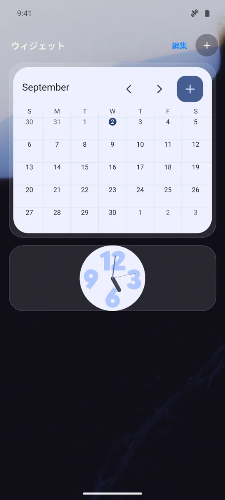
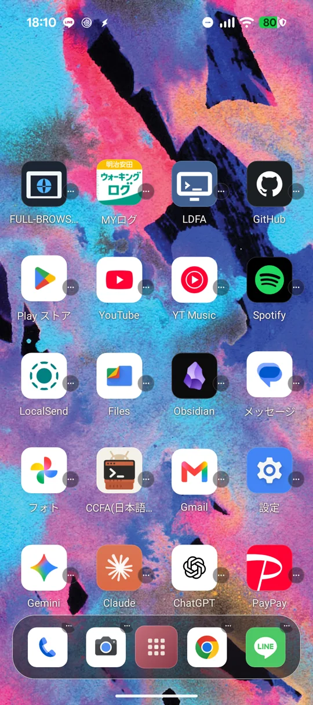
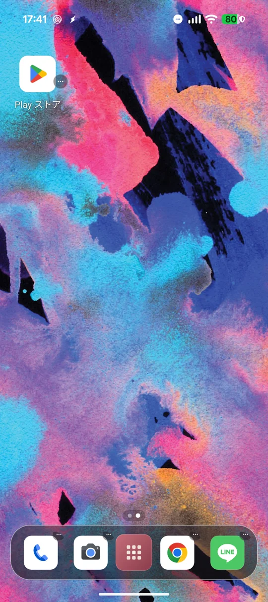
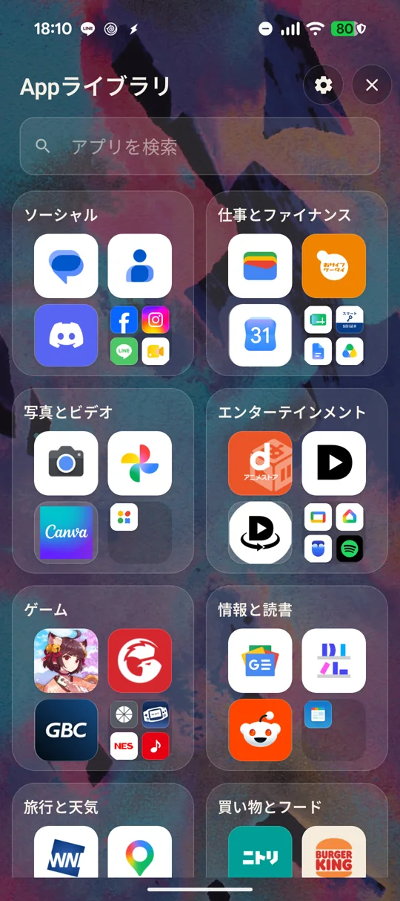
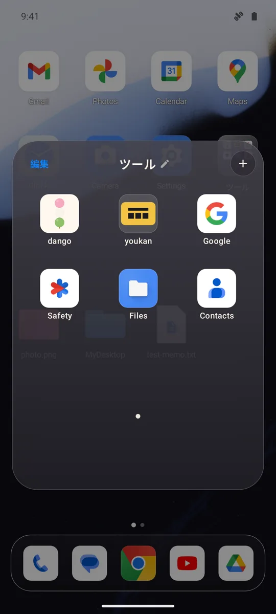
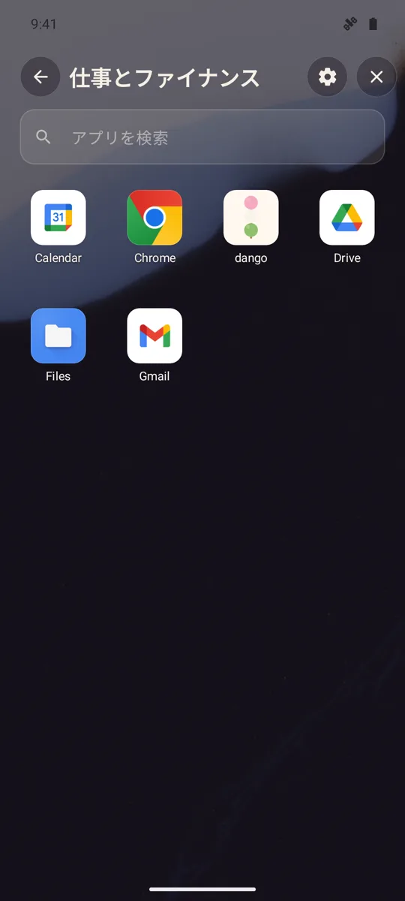
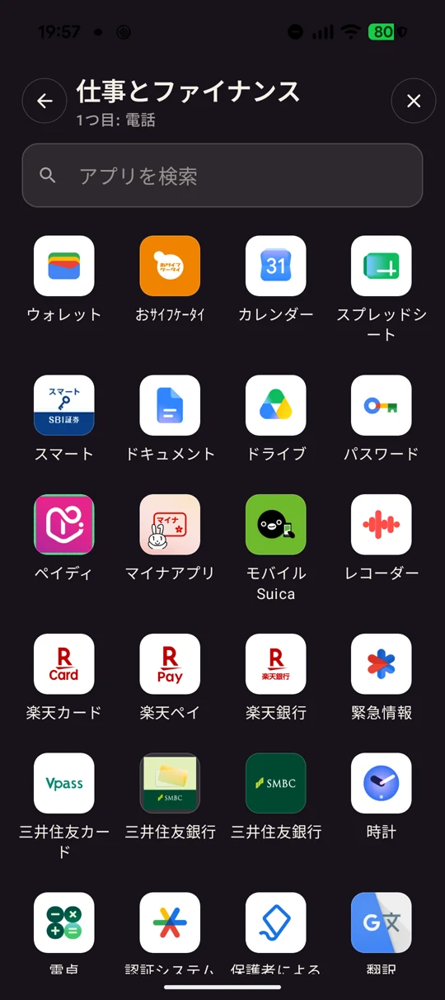

# ohagi

ohagi は、壁紙を主役にしたミニマルな Android ホームランチャーです。iOSを意識した「左端のウィジェット／複数ホーム／右端のAppライブラリ」というページ構成、4列×6行のホーム、ホーム上で常時表示するDock、自動カテゴリー、公式Compose Drag and Drop、OS標準の分割画面起動をひとつにまとめています。

- Application ID: `io.github.hatake716.ohagi`
- Version: `0.1.0` (`versionCode = 1`)
- Android: `minSdk 26` / `targetSdk 36` / `compileSdk 36`
- UI: Kotlin + Jetpack Compose

## スクリーンショット

| ウィジェット専用ページ | ホーム / 常時表示Dock | 追加されたホームページ | 右端のAppライブラリ |
|:--:|:--:|:--:|:--:|
|  |  |  |  |
| Android標準ウィジェットをまとめる左端ページ。Dockは非表示 | 壁紙を隠しにくい4×6ホームと、全枠を変更できる5スロットDock | 最終ホームの右端へD&Dするとページを追加し、項目を移動 | Dockを隠し、全高を使う2列カテゴリーカードと検索 |

| ホーム／Dock共通フォルダ | カテゴリー内アプリ | 分割起動ピッカー |
|:--:|:--:|:--:|
|  |  |  |
| 3×3グリッド、ページドット、名称変更、追加、編集モード | カテゴリーを開くと4列グリッドで一覧表示 | 通知の `ohagi` から開き、通常起動済みのアプリへ追加する2つ目を選択 |

表示されるアプリ、分類結果、壁紙は端末によって異なります。

## 現在の主な機能

- 1ページあたり4列×6行・24セル、最大10ページのホームグリッド
- 最終ホームの右端へ項目をD&Dすると、新しいホームページを自動生成して移動
- 左端にAndroid標準ウィジェット専用ページ、右端にAppライブラリを置くiOS風ページ構成
- 5つすべてにアプリ／フォルダを配置でき、ホーム上だけで常時表示するDock
- インストール済みアプリを自動分類するAppライブラリ
- 通常ドロワー、分割起動、Dock割り当て、フォルダ追加で共通のカテゴリー選択UI
- カテゴリーカードからの直接起動、カテゴリー内4列表示、全アプリ横断検索
- iOSを意識した60dpのホームアイコン、4列の余白比、角丸、控えめな縁と影、半透明パネル
- 押下時の縮小とスプリング復帰、短いオーバーレイ遷移
- Compose公式Drag and Dropによる配置、入れ替え、領域間移動、配置削除
- ホーム／Dock共通のiOS風フォルダ（3×3ページ、プレビュー、名称変更、追加、並べ替え、外への移動）
- `AppWidgetHost`による実ウィジェット表示、検索式ピッカー、OS許可・設定、並べ替え、削除
- ホーム／Dock／フォルダ／Appライブラリから1つ目を通常起動し、通知の `ohagi` から2つ目を選ぶOS標準分割画面
- DataStoreによる複数ホーム／Dock／フォルダ／ウィジェット配置の端末内保存
- Androidのホームアプリ役割を要求する設定導線

## ホームとDock

各ホームページは縦6行・横4列の固定グリッドです。各セルは空き状態を保持するため、アプリやフォルダを任意の位置へ配置できます。最終ホーム上の項目を画面右端までドラッグして離すと、Appライブラリの手前に新しいページを1枚追加し、その項目を先頭の空きセルへ原子的に移動します。ドロップをキャンセルした場合は空ページを自動回収します。上限は10ページです。

ページは左から次の順に並びます。

1. ウィジェット専用ページ
2. 1枚以上のホームページ
3. Appライブラリ

このため、指の動きとしては最初のホームを**右へスワイプ**すると左隣のウィジェットページへ、最終ホームを**左へスワイプ**すると右隣のAppライブラリへ移動します。ホームを複数作成した場合は、その間を通常の横スワイプで移動できます。画面下部のページドットはホームページだけを示します。

レイアウトの永続化形式はv7です。既存v6以前の4スロットDockは、左側2枠を新しい0・1番、右側2枠を3・4番へ保ったまま移し、新しい中央の2番を空きスロットとして追加します。既存のv5データは24セルをそのまま第1ホームとして読み込み、ウィジェット未配置の状態で利用できます。旧v4の5列×6行データを読み込んだ場合は次のように移行します。

1. 各行の左4セルは同じ行・列を維持します。
2. 旧5列目にあった項目は、4×6内の空きセルへ順番に退避します。
3. 第1ページの24セルを超える旧項目は保持できないため、移行前のv4データでは空きセルの確保を推奨します。

Dockはホームページ上で常時表示され、ウィジェット専用ページとAppライブラリではコンテンツ領域を確保するため非表示になります。以前の「アプリ起動後に隠し、下端スワイプで再表示する」動作と中央の固定ランチャーボタンは廃止されています。5つの全スロットへアプリまたはフォルダを置けます。ホームとDockのフォルダは同じ見た目と編集機能を使い、フォルダ自体も両領域の間で移動できます。

## Appライブラリと自動カテゴリー

インストール済みの起動可能アプリは、Androidが公開する `ApplicationInfo.category` を主な入力として自動分類されます。Androidの標準カテゴリーだけでは不足する分野は、パッケージ名と表示名の補助判定で補完します。

現在のカテゴリーは次の11種類です。

- ソーシャル
- 仕事とファイナンス
- 写真とビデオ
- エンターテインメント
- ゲーム
- 情報と読書
- 旅行と天気
- 買い物とフード
- 健康とフィットネス
- ユーティリティ
- その他

Appライブラリの概要画面は2列のカード表示です。カード内の大きいアイコンはアプリを直接起動または選択し、カード本体か小さいアイコン群を押すとカテゴリー内の4列一覧へ移動します。検索はカテゴリーに関係なく全アプリを対象にします。

このカテゴリーUIは次のすべての選択画面で共用しています。

- 最終ホームの右隣にある通常のAppライブラリ
- 通常起動後、通知の `ohagi` から開く分割起動用の2つ目の選択
- Dockスロットへのアプリ割り当て
- ホーム／Dockフォルダへのアプリ追加・新規フォルダ作成（複数選択対応）

分類は端末が持つメタデータと補助ルールに基づくため、ストア上のカテゴリーと完全に一致するとは限りません。利用履歴やクラウドサービスは使用しません。

## ウィジェット専用ページ

最初のホームの左隣には、Android標準App Widgetだけをまとめる専用ページがあります。このページではDockを表示しません。

- 右上または空状態カードの「＋」から、端末にインストールされたホーム画面向けウィジェットを選択できます。
- ピッカーはウィジェット名・提供アプリ名を対象に検索できます。
- 追加時はAndroid標準の確認画面を開きます。提供元が設定画面を持つ場合は、その設定も完了してから配置します。
- `AppWidgetHostView`で提供元の実際のRemoteViewsを表示し、ホストの開始／停止と画面サイズ通知をActivityライフサイクルに同期します。
- 「編集」では上下への並べ替えと削除ができます。削除時はDataStoreの配置だけでなく、割り当て済みApp Widget IDも解放します。
- 許可や設定をキャンセルした場合も、仮確保したIDを解放して未完成の配置を残しません。

ohagiが保存するのはApp Widget ID、提供元コンポーネント、表示高、並び順だけです。ウィジェット内の表示内容や通信は提供元アプリが管理します。

## 操作方法

| 場所 | 操作 | 動作 |
|---|---|---|
| ホーム | アプリアイコンをタップ | アプリを通常起動 |
| ホーム | フォルダをタップ | 3×3ページ式のフォルダを開く |
| ホーム | 項目を長押ししてドラッグ | ホーム内で入れ替え、またはDockへ移動。アプリを別アプリ／フォルダ中央へ重ねるとフォルダ化／追加 |
| 最終ホーム | 項目を右端までドラッグしてドロップ | Appライブラリの手前にホームを1枚追加し、その項目を新しいページへ移動 |
| ホーム背景 | 左右にスワイプ | 複数ホーム間を移動。最初のホームから右へスワイプするとウィジェット、最終ホームから左へスワイプするとAppライブラリ |
| ホーム | アイコン横の「⋯」 | 起動、フォルダ作成・編集、アプリ情報、配置削除、アンインストール |
| Dock | アプリをタップ | アプリを通常起動 |
| Dock | フォルダをタップ | フォルダを開く |
| Dock | 項目を長押ししてドラッグ | Dock内で入れ替え、またはホームへ移動。アプリを重ねるとフォルダ化／追加 |
| Dock | スロット右上の「⋯」 | アプリ割り当て、フォルダ操作、配置削除 |
| 開いたフォルダ | 左上の「編集」 | アイコンを揺らし、各アプリの「−」でフォルダから除外 |
| 開いたフォルダ | 名前／鉛筆、右上の「＋」 | 名前変更、カテゴリー式ピッカーから複数アプリ追加 |
| 開いたフォルダ | アプリを長押ししてドラッグ | フォルダ内で並べ替え。パネル外へ運ぶとホーム／Dockへ移動 |
| Appライブラリ | カード内の大きいアイコンをタップ | アプリを直接起動または選択 |
| Appライブラリ | カード本体／小アイコン群をタップ | カテゴリー内の4列一覧を開く |
| Appライブラリ | アプリを長押ししてドラッグ | ホームまたはDockへ配置 |
| Appライブラリ | アプリ横の「⋯」 | Dock追加、アプリ情報、アンインストール |
| 1つ目のアプリ起動後 | 通知内の `ohagi` をタップ | 自動カテゴリー式の選択画面を開き、分割する2つ目のアプリを選択 |
| ウィジェットページ | 「＋」 | 検索式ピッカーとAndroidの確認／設定画面を経てウィジェットを追加 |
| ウィジェットページ | 「編集」 | ウィジェットの表示順変更または削除 |

ホームまたはDockの配置済み項目をドラッグすると、画面上部に削除領域が表示されます。そこへドロップするとohagi上の配置だけを削除し、アプリ本体はアンインストールしません。アンインストールは「⋯」メニューからAndroidの確認画面を開いて実行します。

## Drag and Drop

D&DはCompose公式の `Modifier.dragAndDropSource` と `Modifier.dragAndDropTarget` を使用しています。ドラッグデータはohagi専用MIME型の `ClipData` とシリアライズ済みpayloadで受け渡し、他アプリのドラッグを誤って受け入れないようにしています。

| ドラッグ元 → ドロップ先 | 結果 |
|---|---|
| アプリ → 空きセル／スロット | その位置へ移動または配置 |
| アプリ → 別アプリの中央 | 2アプリをまとめてフォルダを作成。共通カテゴリーがあれば初期名へ使用 |
| アプリ → 既存フォルダ | フォルダへ追加 |
| 項目 → セル／スロット外周 | アプリまたはフォルダを入れ替え（空き位置との入れ替えを含む） |
| ホームの項目 → Dock／Dockの項目 → ホーム | アプリ／フォルダを型変換して移動。相手がいれば項目ごと入れ替え |
| 開いたフォルダ内 → 同じフォルダ内 | 3×3ページでの表示順を変更 |
| 開いたフォルダ内 → ホーム／Dock | アプリだけをフォルダ外へ移動。最後のアプリを外して空になるとフォルダを自動削除 |
| Appライブラリ → ホーム／Dock | 指定位置へアプリを配置。中央へ重ねればフォルダ化／追加 |
| 最終ホームの項目 → 画面右端 | 新しいホームページを生成し、取得元の除去と新ページへの配置を1回のDataStore更新で完了 |
| ホーム／Dock／フォルダ内 → 削除領域 | ohagi上の配置だけを削除 |

アプリを重ねる判定は、60dpのアイコンを囲む中央68dp領域です。フォルダの中身を取り出す操作と取得元の更新は1回のDataStoreトランザクションで処理するため、移動途中の複製や消失を防ぎます。iOSと同様にアプリが1個だけになってもフォルダは維持し、空になった時だけ自動削除します。

## 画面固定と省メモリ設計

ホームランチャー自身はAndroidの自動回転設定にかかわらず縦画面へ固定します。アプリを起動した後の画面方向は、起動先アプリとAndroidの設定に従います。

RAMの少ない端末でも長時間使えるよう、再生成可能なデータを中心に保持量を制限しています。

- アプリアイコンは表示寸法に応じて96／144／192pxへ段階化し、小さいプレビューに大きなBitmapを使いません。
- アイコンキャッシュはバイト数で上限を管理し、通常端末は6MiB、AndroidがLow-RAM端末と判定した場合は3MiBに制限します。
- `onTrimMemory`／`onLowMemory`を受けると、前面低メモリ時は2MiB、UI非表示時は1MiBまで縮小し、バックグラウンド圧迫時は全解放します。
- 空のホーム／Dockセルはアイコン監視Coroutineを作らず、表示アイコンとD&D装飾は同じBitmapを共有します。
- アプリ一覧の全件走査は連続要求をまとめ、前面復帰時の再走査を15秒間隔に抑えます。
- DataStoreへのレイアウト変更は単一キューで操作順を維持し、操作ごとのCoroutine生成を避けます。
- フォルダの無限揺れアニメーションは編集モード中だけ実行し、通常表示ではcompositionから外します。

## 分割画面起動

ohagi自身がウィンドウを分割・管理するのではなく、Androidの標準タスク／分割画面機能を使用します。操作は次の順です。

1. ホーム、Dock、フォルダ、またはAppライブラリから、1つ目のアプリを普段どおりタップして起動します。
2. ohagiが、その起動したアプリを1つ目として紐づけた通知を表示します。
3. 通知内の `ohagi` をタップし、自動カテゴリー式のAppライブラリを開きます。
4. 2つ目のアプリをカテゴリーまたは検索から選ぶと、Android標準の分割画面へ移行します。

通知を開くと、履歴に残らない非公開の選択Activityが表示されます。2つ目の選択後は、そのActivityを有効な起点として2つ目を `FLAG_ACTIVITY_LAUNCH_ADJACENT` と `FLAG_ACTIVITY_NEW_TASK` 付きで隣接起動し、OSから分割成立が通知された後に主画面側を1つ目へ差し替えます。

- 1つ目は先に通常起動され、ohagiが起動した正確なコンポーネントを通知へ保持します。利用履歴や現在前面のアプリを推測する権限は使用しません。
- 1つ目のアプリが表示された後にユーザー自身が通知を開くため、cold startの時間を固定遅延で推測しません。
- 2つ目の隣接起動と1つ目の配置はOSの分割状態コールバックで区切り、同じ画面遷移へ混在させません。
- 通知の `PendingIntent` は非公開の分割起動Activityを直接指し、BroadcastReceiver／Serviceの通知トランポリンを使用しません。
- `PendingIntent` は変更不能ですが繰り返し利用できます。`ohagi` をタップしても通知は消えず、分割完了後も同じ1つ目に対して再利用できます。次にohagiから別のアプリを通常起動すると、通知の紐づけと表示を最新の1つ目へ置き換えます。
- 通知は常駐通知として表示し、タップや分割完了では自動削除しません。Android 14以降ではOSの仕様によりユーザー自身の横スワイプで明示的に消すこともでき、通知設定から「画面分割」チャンネルまたはohagiの通知権限を無効にすることもできます。
- Android 13以降では、最初の通常起動操作の文脈で通知権限を一度だけ要求します。拒否された場合や通知チャンネルが無効な場合もアプリは通常起動しますが、通知を使う分割導線は表示されません。
- この機能はohagi自身の常駐通知を表示するだけで、他アプリの通知内容を読み取りません。

- 縦画面では通常は上下、横画面では通常は左右に配置されます。
- Android 12L（API 32）以降を主対象とします。
- API 31以前でも起動は試みますが、分割画面への移行は保証されません。
- 端末、対象アプリの `launchMode`、既存タスクの状態によっては、2つ目が全画面で起動する場合があります。
- 他アプリの前面タスク状態を通常権限で完全には監視できないため、OS側の分割状態はDataStoreへ保存しません。

## データとプライバシー

ホーム、Dock、フォルダ、ウィジェットの配置情報は、AndroidX DataStoreを使ってアプリ専用領域の `layout.json` に保存します。ウィジェットについて保存するのはID、提供元コンポーネント、表示高、並び順であり、ウィジェットが表示する内容そのものは保存しません。

- インターネット権限は要求しません。
- `POST_NOTIFICATIONS` は、通常起動した1つ目に追加する2つ目をユーザー操作で選ぶ通知だけに使用します。通知アクセス権限は要求せず、他アプリの通知を読み取りません。
- 個人情報、アプリ利用履歴、レイアウトを外部へ送信しません。
- Androidバックアップと端末間転送は、Manifestと`dataExtractionRules`の両方で明示的に無効化しています。
- アプリ一覧は端末上のランチャー対象Activityから取得します。
- ウィジェットの追加はAndroid標準の `ACTION_APPWIDGET_BIND` でユーザー確認を受けます。提供元ウィジェット自身の通信・データ処理には、その提供元アプリのプライバシーポリシーが適用されます。

詳細は [プライバシーポリシー](docs/PRIVACY_POLICY.md) を参照してください。

## プロジェクト構成

単一Androidアプリモジュールで、Jetpack Compose、DataStore、kotlinx.serialization、手動DI（`Graph`）を使用しています。

| パス | 役割 |
|---|---|
| `data/Model.kt` | `AppRef`、ホーム／Dock項目、複数ページ、ウィジェット配置モデル |
| `data/LayoutRepository.kt` | DataStore永続化、5×6から4×6への移行、配置・移動・入れ替え |
| `data/LayoutFolderOperations.kt` | フォルダ内外・ホーム／Dock間を原子的に更新する純粋関数 |
| `data/LayoutPageOperations.kt` | ページ追加／回収、ページ切替D&D、ウィジェット順序の純粋関数 |
| `data/AppRepository.kt` | 起動可能アプリの列挙、ラベル・カテゴリー、段階解像度アイコン、容量制限キャッシュ、低メモリ解放 |
| `data/AppCategory.kt` | Androidカテゴリーと補助ルールによる自動分類 |
| `ui/HomeScreen.kt` | Widget／Home／AppライブラリPager、Dock表示、D&D規則、起動導線の統合 |
| `ui/home/HomeGrid.kt` | 4×6ホームセルの表示とD&D source／target |
| `ui/dock/DockBar.kt` | 常時表示Dock、フォルダプレビュー、D&D source／target |
| `ui/folder/IosFolderOverlay.kt` | ホーム／Dock共通の3×3ページ式フォルダ表示・編集・D&D |
| `ui/drawer/AppDrawer.kt` | Appライブラリ、アプリのドラッグ元、操作メニュー |
| `ui/widget/WidgetPage.kt` | Dockを持たないウィジェット専用ページ、実ウィジェット表示、編集 |
| `ui/widget/WidgetPickerSheet.kt` | インストール済みウィジェットの検索・選択UI |
| `SplitLaunchActivity.kt` | 通知からカテゴリー式ピッカーを表示し、OSの分割成立後に主画面側を1つ目へ差し替え |
| `ui/common/SplitAppPickerScreen.kt` | 通知専用の2つ目選択画面。Appライブラリと同じカテゴリー／4列／検索UIを再利用 |
| `util/SplitLaunchNotification.kt` | 通常起動した1つ目を保持し、非公開ピッカーを繰り返し開ける常駐通知PendingIntentと通知チャンネル |
| `widget/WidgetHostController.kt` | App Widget ID、許可・設定、HostView、サイズ通知、ライフサイクル管理 |
| `ui/common/CategorizedAppBrowser.kt` | 全選択画面で共用するカテゴリーカードと4列一覧 |
| `ui/common/IosStyle.kt` | 共通アイコン形状、押下モーション、半透明コントロール |
| `ui/dragdrop/DragPayload.kt` | ohagi専用D&D payload、MIME型、共通modifier |
| `util/LaunchUtils.kt` | 通常／隣接／同一タスク起動Intent、アプリ情報、アンインストール、ホーム役割要求 |

## ビルド

### 必要環境

- JDK 17
- Android SDK Platform 36
- Android Build Tools 36系

### デバッグビルドと検証

```sh
./gradlew :app:assembleDebug :app:testDebugUnitTest :app:lintDebug
```

デバッグAPKは `app/build/outputs/apk/debug/app-debug.apk` に生成されます。接続済み端末へ上書きインストールする場合は次を実行します。

```sh
adb install -r app/build/outputs/apk/debug/app-debug.apk
```

リリース用Android App Bundleは次で生成できます。署名する場合はプロジェクトルートへ `keystore.properties` を用意してください。

```sh
./gradlew :app:bundleRelease
```

Google Play公開前の確認事項は [PLAY_CHECKLIST.md](docs/PLAY_CHECKLIST.md) を参照してください。

## 既知の制約

- ホームは1ページ24セル・最大10ページです。ページの任意追加／削除UIはなく、最終ページ右端へのD&Dで追加し、末尾の空ページだけを自動回収します。
- ウィジェットの高さは提供元の推奨サイズから決めます。現時点ではドラッグによる自由リサイズには対応していません。
- ウィジェットの表示内容や設定画面の外観、更新頻度、ネットワーク要否は各提供元アプリに依存します。
- iOSのシステムアイコン、独自フォント、壁紙ぼかしAPIそのものは使用せず、Composeの角丸・半透明・影・スプリングで近い外観を構成しています。
- Android 16以降の大画面端末では、OSの適応型レイアウト方針により縦画面固定が無視される場合があります。Pixelのスマートフォン実機では縦固定を確認しています。
- 自動カテゴリーはAndroidメタデータと補助判定による推定です。
- 分割画面が成立するかはAndroidバージョン、端末実装、対象アプリに依存します。

## 実機検証

現在の実装では、Pixel実機で次の操作を確認しています。

- Appライブラリからホーム／DockへのD&D配置と画面への即時反映
- ホーム内、Dock内、ホーム↔Dockの入れ替え／移動
- ホーム／Dockから削除領域への配置削除
- 4列の先頭行、2行目、6行目への配置による4×6セル構成
- Appライブラリのカテゴリー一覧、4列詳細、検索、最下部カテゴリーまでのスクロール
- Appライブラリからカレンダーを通常起動 → 通知の `ohagi` → 「1つ目: カレンダー」と表示するカテゴリー式ピッカー → 連絡先を選択、の順で上下分割が成立すること
- ピッカーを開いた後と分割完了後も `ohagi` 通知が残り、同じボタンから再び2つ目を選べること
- フォルダ追加におけるカテゴリーをまたいだ複数選択
- ホーム上のアプリ同士を中央へ重ねたフォルダ作成とDataStoreへの即時反映
- フォルダ名変更、カテゴリー式ピッカーから8アプリを追加した10アプリ／2ページ表示
- フォルダ内の長押しD&D並べ替えと、背面ホームセルへ漏れないターゲット優先順
- フォルダ内アプリのホームへの取り出しと上部削除領域への配置削除
- フォルダ本体のホーム→Dock／Dock→ホーム移動、相手項目との入れ替え、Dockからの再表示
- 編集モードで1アプリまで減らした時のフォルダ維持と、最後の1件を外した時の自動削除
- 最初のホームからウィジェットページ、複数ホーム、右端Appライブラリまでの双方向スワイプ
- ホームではDockが常時表示され、ウィジェットページとAppライブラリでは非表示になること
- インストール済みウィジェットの検索式ピッカー、Android標準バインド許可、実`AppWidgetHostView`表示、編集モードからの削除とID解放
- 最終ホームのアプリを右端へD&Dした際の2ページ目生成、元セルの消去、新ページへの配置、48セルへのDataStore拡張
- 2ページ目から右端Appライブラリ、1ページ目、左端ウィジェットページへの連続スワイプ
- システム側を横向きへ強制した状態でも、ohagiのActivityが縦1080×2424表示を維持すること
- `RUNNING_LOW`低メモリ通知後もAppライブラリ表示を保ち、再生成可能なBitmapを解放すること

20件のユニットテストでは、ホーム／Dock共通フォルダの作成・追加・並べ替え・領域間移動・空フォルダ削除に加え、旧4枠Dockから中央空き5枠への移行、中央枠へのアプリ／フォルダ移動と右端5番目スロット、ページ追加、ページをまたぐ原子的移動、空ページ回収、右端ドロップ時のページ生成、フォルダ形状を保ったページ移動、ウィジェット順序変更を検証しています。

ソース確認だけでなく、実機上のドラッグ操作とDataStore反映まで含めて検証しています。
